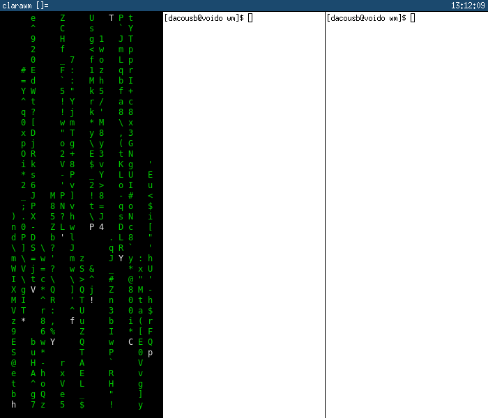

# clarawm
> *a simple floating window manager*

clarawm is designed to be a simple floating (with drag and drop tiling) window manager, fast and with a light and simple code base, so that anyone can understand the code.



# Build and Install
Clone this repo
```
git clone https://github.com/dacousb/clarawm
```
Run the install script (will ask for root permissions)
```
sh install.sh
``` 
The config file will be in `~/.config/clarawm/config.h`

## Shortcuts (keys)

The default configured modifier is Mod4 (⌘). This can be combined with the following keys to achieve different results:

|   | Key    | Action        |
|---|--------|---------------|
| ⌘ | Return | Open terminal |
| ⌘ | d      | Open launcher |
| ⌘ | q      | Close window  |
| ⌘ | k      | Kill wm       |
| ⌘ | MouseL | Move window   |
| ⌘ | MouseR | Resize window |

## To do
Looking to get involved in the project or just know what do clarawm need to improve? Here it is:
- Create a true tiling mode.
- Try to introduce virtual workspaces.

Note: clarawm is not intended to replace other window managers, I was just looking for a clean and simple manager for me.
